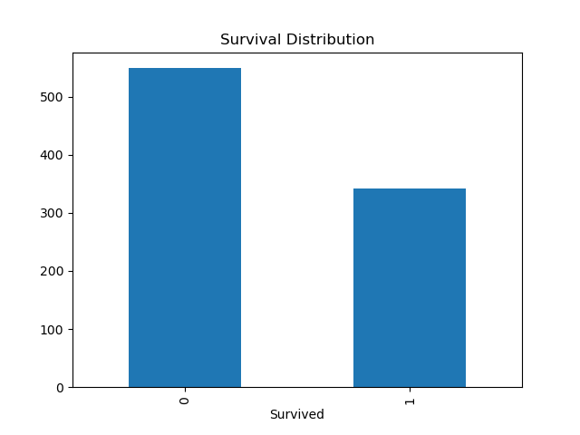

# 🚢 Titanic Survival Prediction using Machine Learning

> Can we predict who survived the Titanic disaster using data?

This project explores the famous Titanic dataset and applies Machine Learning techniques to predict passenger survival based on demographic and travel information.


---

## 🎯 Project Goal

The objective of this project is to build a classification model that predicts whether a passenger survived the Titanic disaster.

Through this project I practiced:

✅ Data Cleaning
✅ Exploratory Data Analysis (EDA)
✅ Feature Engineering
✅ Data Visualization
✅ Machine Learning Model Building
✅ Model Evaluation

---

## 📊 Dataset Overview

The dataset contains information about Titanic passengers including:

| Feature  | Description                       |
| -------- | --------------------------------- |
| Age      | Passenger age                     |
| Sex      | Gender                            |
| Pclass   | Ticket class                      |
| Fare     | Ticket fare                       |
| SibSp    | Number of siblings/spouses aboard |
| Parch    | Number of parents/children aboard |
| Embarked | Port of embarkation               |

Target Variable:

**Survived**

* 0 → Did Not Survive
* 1 → Survived

---

## 🔍 Exploratory Data Analysis

Some interesting insights discovered during analysis:

* Female passengers had significantly higher survival rates.
* First-class passengers survived more often than third-class passengers.
* Passengers travelling with family had different survival patterns than solo travelers.
* Age distribution showed survival differences among children and adults.

### Survival Distribution

<p align="center">
  
</p>

### Survival by Gender

<p align="center">
  
</p>

---

## ⚙️ Data Preprocessing

The dataset required several preprocessing steps:

* Handling missing values
* Dropping Cabin column due to excessive null values
* Encoding categorical variables
* Feature engineering
* Train/Test split

---

## 🧠 Feature Engineering

Created a new feature:

```python
FamilySize = SibSp + Parch + 1
```

This feature captures the total number of family members travelling together.

---

## 🤖 Model Training

Model Used:

### Logistic Regression

```python
from sklearn.linear_model import LogisticRegression

model = LogisticRegression(max_iter=1000)
model.fit(X_train, y_train)
```

---

## 📈 Model Performance

| Metric   | Score |
| -------- | ----- |
| Accuracy | 82%   |

Add your actual accuracy score here.

---

## 📂 Project Structure

```text
Titanic-Survival-Prediction/
│
├── data/
├── notebooks/
├── images/
├── submission.csv
├── requirements.txt
└── README.md
```

---

## 🚀 Future Improvements

* Random Forest Classifier
* XGBoost
* Hyperparameter Tuning
* Cross Validation
* Feature Importance Analysis

---

## 💡 Key Learnings

This project helped me understand:

* Real-world data preprocessing
* Handling missing values
* Feature engineering techniques
* Machine Learning workflow
* Model evaluation and validation

---

## 👨‍💻 About Me

Aspiring AI/ML Engineer passionate about building practical machine learning solutions and continuously learning new technologies.

If you found this project useful, consider giving it a ⭐.
